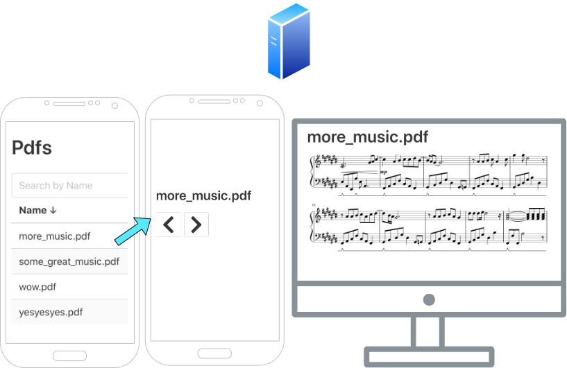

# PDF viewer and selector

Application that serves three pages, intended to be viewed two, separate devices:

- A list of PDFs in the configured directory. When a PDF is selected, the page updates to forward and backward buttons.
- A view of the PDF itself.

My use case was to select sheet music from my phone which would appear on the display, attached to a raspberry pi, in front of the instrument.

## Design

Elm is used for the PDF listing and next/prev buttons. The backend is written in Scala with ZIO and http4s. 
The PDF viewer is HTML and javascript connecting to the server through a websocket.

## Build and deploy

### Compile the elm

I haven't found a good workflow using Elm and SBT so do this for now:

`elm make src/main/assets/elm/Main.elm --output src/main/resources/assets/elm.js`

### Ship to pi

`sbt assembly`

`scp target/scala-2.13/pdf-elm-viewer-assembly-0.0.1.jar pi@192.168.178.87:~/Desktop`

### Start on pi

`ssh pi@192.168.178.87`

`cd Desktop`

`java -jar -Dconfig.file=application.conf pdf-elm-viewer-assembly-0.0.1.jar`

## Notes to self

- Websockets example usage: https://github.com/MartinSnyder/http4s-chatserver/blob/master/src/main/scala/com/martinsnyder/chatserver/ChatRoutes.scala

- sbt-elm: https://github.com/choucrifahed/sbt-elm/blob/master/src/main/scala/sbt/elm/SbtElm.scala

- static: https://github.com/ChristopherDavenport/http4s-static-resource-example/blob/master/src/main/scala/io/chrisdavenport/http4sstaticresourceexample/StaticSite.scala